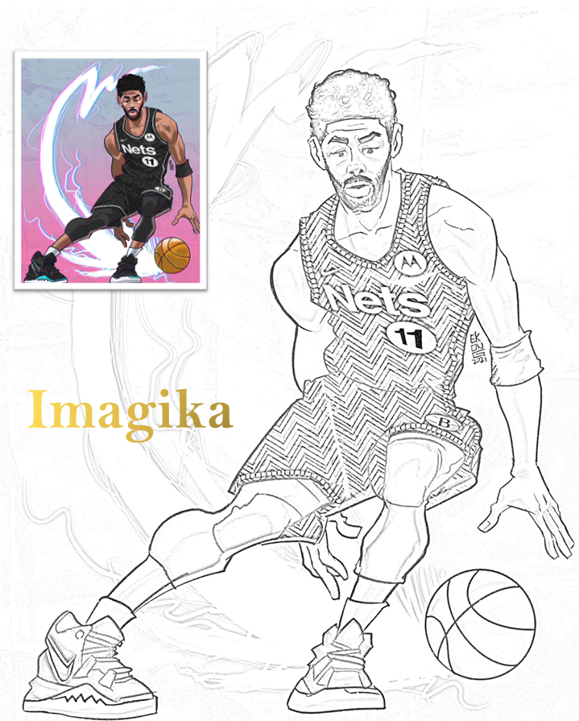

# Imagika

It is Imagika, Use to convert images to pencil sketch....



## Features / Tasks it can perform:

1. Convert Images to Pencil Sketch
2. User Friendly GUI  
   (a) Modal window for image input in multiple extension  
   (b) Modal window to save image in multiple extension  
   (c) Option to view recent images in GUI
3. Saves images with same name as user input

## Modules Installation:

pip install tkinter  
pip install Pillow  
pip install opencv-python

## Module Requirements:

1. tkinter
2. Pillow(PIL)
3. opencv(CV2)
4. datetime
5. time
6. os
7. glob

```
4,5,6 are Python inbuild modules
Python 3.9.8
```

## Dependencies:

1. fileHandler
2. sketch_generator

## Assets:

1. images

## Author

**vijay-kumar-yadav**

See also the list of [contributors](https://github.com/vijay-kumar-yadav/Image-to-pencil-sketch__Imagika/graphs/contributors) who have participated in this project.

## License

This is an open source project.
